# Property Management System

This project implements a simple CRUD (Create, Read, Update, Delete) system for managing real estate properties using a Spring Boot backend and a frontend built with HTML, CSS, and JavaScript. It allows users to create, update and delete for properties, with data stored in a MySQL database.

## Getting Started

The following instructions will allow you to run the project locally on your machine.

### Prerequisites

You need to have the following installed:

1. **Java** (versions 17 or 21)
   To verify the version in a console or terminal, run:

   ```sh
   java -version
   ```

   The output should look something like this:

   ```sh
   java version "17.0.12" 2024-07-16 LTS
   Java(TM) SE Runtime Environment (build 17.0.12+8-LTS-286)
   Java HotSpot(TM) 64-Bit Server VM (build 17.0.12+8-LTS-286, mixed mode, sharing)
   ```

2. **Maven**
   - To download, visit [here](https://maven.apache.org/download.cgi).
   - Follow the installation instructions [here](http://maven.apache.org/download.html#Installation).
   To verify the installation, run:

   ```sh
   mvn -v
   ```

   The output should look something like this:

   ```sh
   Apache Maven 3.9.9 (8e8579a9e76f7d015ee5ec7bfcdc97d260186937)
   Maven home: /Applications/apache-maven-3.9.9
   Java version: 17.0.12, vendor: Oracle Corporation, runtime: /Library/Java/JavaVirtualMachines/jdk-17.jdk/Contents/Home
   Default locale: es: `CO, platform encoding: UTF-8
   OS name: "mac os x", version: "12.7.6", arch: "x86: `64", family: "mac"
   ```

3. **Git**
   - To download, visit [here](https://git-scm.com/downloads).
   - Verify the installation by running:

   ```sh
   git --version
   ```

   The output should look something like this:

   ```sh
   git version 2.46.0
   ```

4. **Docker**
   - To download, visit [here](https://www.docker.com/).
   - Verify the installation by running:

   ```sh
   docker --version
   ```

   The output should look something like this:

   ```sh
   Docker version 25.0.3, build 4debf41
   ```

### Installation

1. Clone the repository and navigate to the folder containing the `pom.xml` file using the following commands:

   ```sh
   git clone https://github.com/Mar972310/AREP_BONO_PARCIAL.git
   cd AREP_BONO_PARCIAL
   ```
2. Create a database in a Docker container using the following command:

```
  docker run -p 3306:3306 --name properties  -e MYSQL_ROOT_PASSWORD=my-secret-pw -d mysql:latest
``` 

3. Build the project:

   ```sh
   mvn clean package
   ```

   The console output should look something like this:

   ```sh
    [INFO] ------------------------------------------------------------------------
    [INFO] BUILD SUCCESS
    [INFO] ------------------------------------------------------------------------
    [INFO] Total time:  21.968 s
    [INFO] Finished at: 2025-03-06T22:51:13-05:00
    [INFO] ------------------------------------------------------------------------
   ```

4. Run the application:

      ```sh
      mvn spring-boot:run
      ```
      The console should display the following message:
      ```sh
      2025-03-06T22:53:31.058-05:00  INFO 64136 --- [bonoParcial] [           main] o.h.e.t.j.p.i.JtaPlatformInitiator       : HHH000489: No JTA platform available (set 'hibernate.transaction.jta.platform' to enable JTA platform integration)
      2025-03-06T22:53:31.259-05:00  INFO 64136 --- [bonoParcial] [           main] j.LocalContainerEntityManagerFactoryBean : Initialized JPA EntityManagerFactory for persistence unit 'default'
      2025-03-06T22:53:31.702-05:00  WARN 64136 --- [bonoParcial] [           main] JpaBaseConfiguration$JpaWebConfiguration : spring.jpa.open-in-view is enabled by default. Therefore, database queries may be performed during view rendering. Explicitly configure spring.jpa.open-in-view to disable this warning
      2025-03-06T22:53:32.257-05:00  INFO 64136 --- [bonoParcial] [           main] o.s.b.w.embedded.tomcat.TomcatWebServer  : Tomcat started on port 8080 (http) with context path '/'
      2025-03-06T22:53:32.272-05:00  INFO 64136 --- [bonoParcial] [           main] e.e.a.b.BonoParcialApplication           : Started BonoParcialApplication in 7.566 seconds (process running for 8.16)
      ```
5. Search in the browser http://localhost:8080/home
      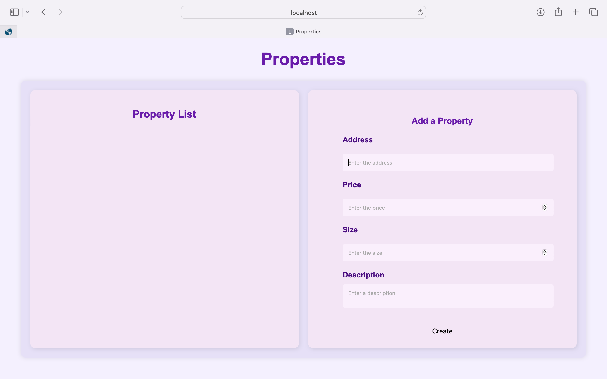
      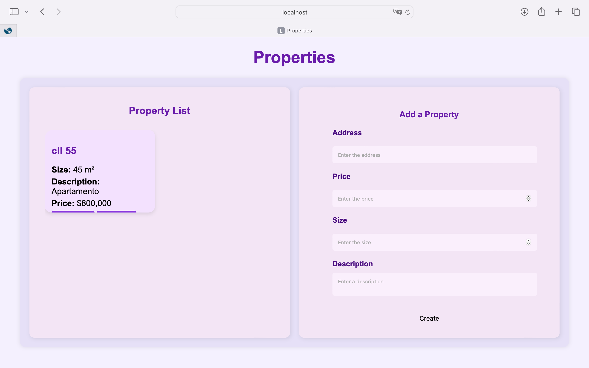
      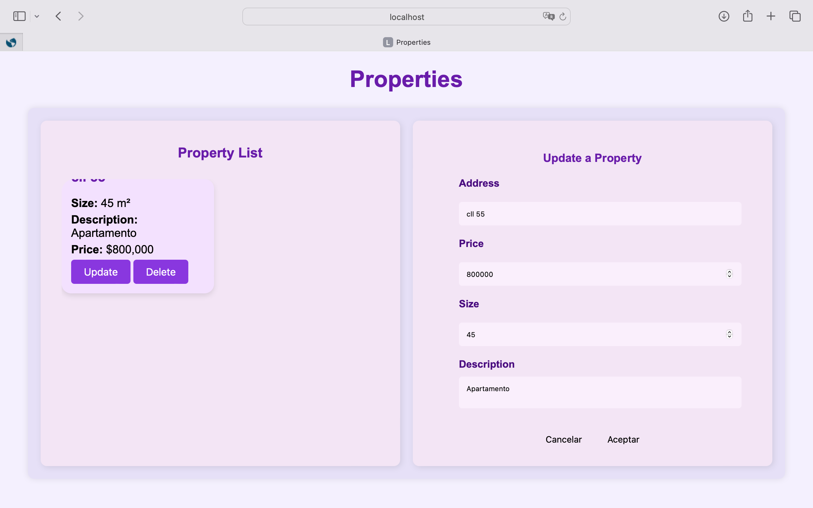
      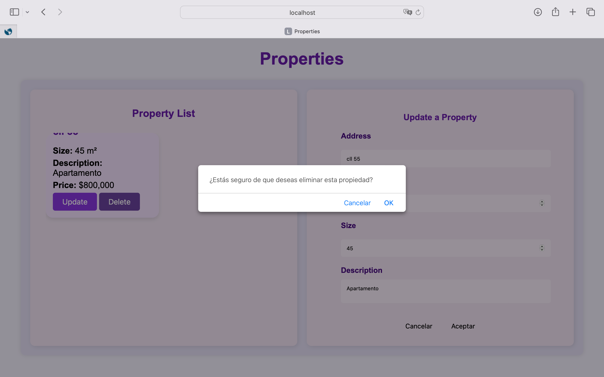


## Architecture

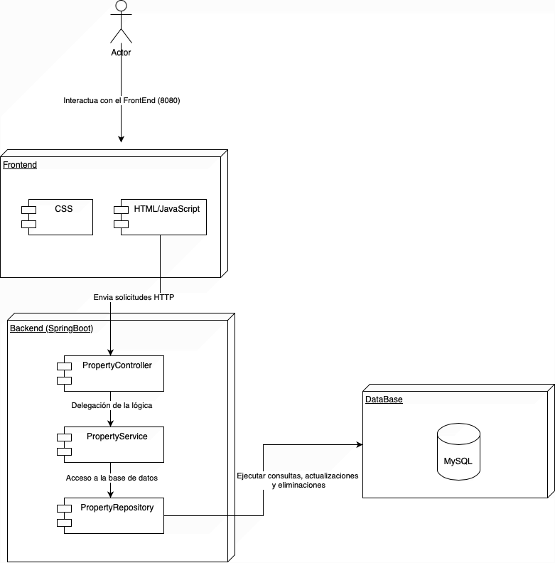

This system follows a **layered architecture** where each layer has a distinct responsibility. The key layers are:

### **1. Presentation Layer (Frontend)**
   - Technologies: **HTML, JavaScript, CSS**.
   - Handles user interactions.
   - Sends HTTP requests to the backend via APIs.

### **2. Controller Layer**
   - Component: **PropertyController**.
   - Exposes REST endpoints.
   - Receives and processes HTTP requests.
   - Delegates logic to the Service Layer.

### **3. Service Layer**
   - Component: **PropertyService**.
   - Contains business logic.
   - Acts as an intermediary between the Controller and Repository layers.

### **4. Data Access Layer (Repository)**
   - Component: **PropertyRepository**.
   - Communicates with the database.
   - Executes queries, updates, and deletions.

### **5. Database Layer**
   - Technology: **MySQL**.
   - Stores and manages application data.

### **Data Flow in the Layered Architecture**

1. The **user interacts** with the frontend.
2. The frontend sends **HTTP requests** to the **Controller Layer**.
3. The **Controller Layer** processes the request and passes it to the **Service Layer**.
4. The **Service Layer** applies business logic and calls the **Repository Layer**.
5. The **Repository Layer** retrieves or modifies data in the **Database Layer**.
6. The **response** flows back through the layers to the **frontend** for display.


## Class diagram

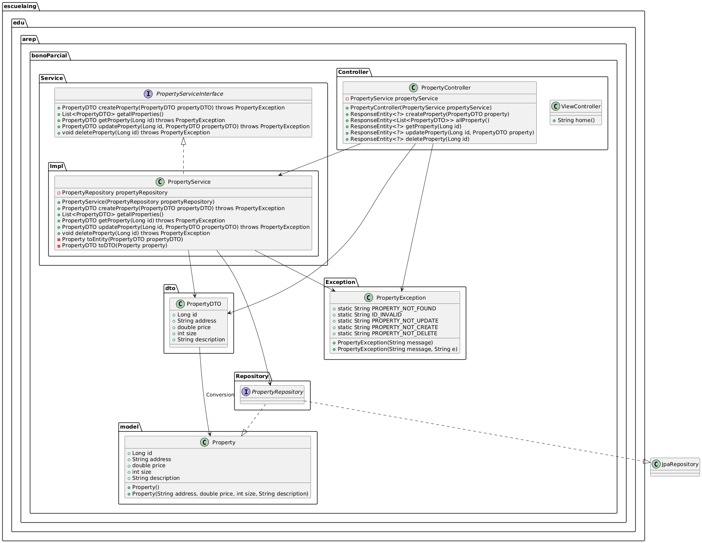

### 1. **`PropertyServiceInterface`** 
- **Purpose:** This interface defines the contract for the `PropertyService` class. It establishes the methods that must be implemented by any property-related service.
- **Functions:**
  - `createProperty(PropertyDTO propertyDTO) throws PropertyException`: Creates a new property.
  - `getallProperties()`: Retrieves a list of all properties.
  - `getProperty(Long id) throws PropertyException`: Gets a property by its ID.
  - `updateProperty(Long id, PropertyDTO propertyDTO) throws PropertyException`: Updates an existing property.
  - `deleteProperty(Long id) throws PropertyException`: Deletes a property by its ID.

### 2. **`PropertyService`** 
- **Purpose:** This is the implementation class for `PropertyServiceInterface`. It provides the actual business logic for handling properties.
- **Functions:**
  - **Constructor:** Initializes the service with a `PropertyRepository` to interact with the database.
  - `createProperty(PropertyDTO propertyDTO) throws PropertyException`: Creates a new property from the provided DTO and saves it to the database.
  - `getallProperties()`: Returns a list of all properties stored in the repository.
  - `getProperty(Long id) throws PropertyException`: Retrieves a property from the repository by its ID. If not found, throws a `PropertyException`.
  - `updateProperty(Long id, PropertyDTO propertyDTO) throws PropertyException`: Updates an existing property in the repository. If updating fails, throws a `PropertyException`.
  - `deleteProperty(Long id) throws PropertyException`: Deletes a property by its ID from the repository. If it fails, throws a `PropertyException`.
  - `toEntity(PropertyDTO propertyDTO)`: Converts a `PropertyDTO` into a `Property` entity (for database interaction).
  - `toDTO(Property property)`: Converts a `Property` entity into a `PropertyDTO` to return it to the user.

### 3. **`Property`** 
- **Purpose:** Represents a property in the system. This is the entity class that is persisted in the database.
- **Functions:**
  - **Attributes:** 
    - `id`: The unique identifier of the property.
    - `address`: The property's address.
    - `price`: The property's price.
    - `size`: The property's size.
    - `description`: A description of the property.
  - **Constructors:**
    - Default constructor: Initializes a `Property` object with default values.
    - Parameterized constructor: Initializes a `Property` object with specific values (address, price, size, description).

### 4. **`PropertyDTO`** 
- **Purpose:** A Data Transfer Object (DTO) used to transfer property data between application layers, such as between the service and the controller.
- **Functions:**
  - Similar to the `Property` class but specifically used for communication. It contains only the necessary data sent via HTTP (e.g., in request or response bodies).
  - **Attributes:** Same as `Property` (id, address, price, size, description).

### 5. **`PropertyException`** 
- **Purpose:** Custom exception class for handling property-related errors.
- **Functions:**
  - **Static constants:** 
    - `PROPERTY_NOT_FOUND`, `ID_INVALID`, `PROPERTY_NOT_UPDATE`, `PROPERTY_NOT_CREATE`, `PROPERTY_NOT_DELETE`: These constants represent common error messages related to property operations.
  - **Constructors:**
    - `PropertyException(String message)`: Constructor that accepts a message describing the error.
    - `PropertyException(String message, String e)`: Constructor that accepts both a message and additional data (e.g., an ID or specific error details).

### 6. **`PropertyController`** 
- **Purpose:** A REST controller that handles HTTP requests related to properties. It receives HTTP requests, delegates logic to `PropertyService`, and returns appropriate HTTP responses.
- **Functions:**
  - **Constructor:** Initializes the controller with an instance of `PropertyService`.
  - `createProperty(PropertyDTO property)`: Handles POST requests to create a new property. Uses `PropertyService` to create the property and returns the appropriate HTTP response.
  - `allProperty()`: Handles GET requests to retrieve all properties.
  - `getProperty(Long id)`: Handles GET requests to get a property by its ID. If not found, returns a `PropertyException`.
  - `updateProperty(Long id, PropertyDTO property)`: Handles PUT requests to update an existing property. Delegates to `PropertyService` and returns the updated property.
  - `deleteProperty(Long id)`: Handles DELETE requests to remove a property by its ID. Calls the `deleteProperty` method in `PropertyService`.

### 7. **`ViewController`** 
- **Purpose:** A simple controller to render the home view (probably an HTML page) when a request is made to the `/home` endpoint.
- **Functions:**
  - `home()`: Returns the view name (`inmobiliaria`), which is used to render the application's home page.

### 8. **`PropertyRepository`** 
- **Purpose:** Interface for interacting with the database. Extends `JpaRepository` to provide CRUD operations for the `Property` entity.
- **Functions:**
  - **Note:** No explicit methods are defined here since `JpaRepository` provides built-in methods like `save()`, `findById()`, `findAll()`, `deleteById()`, etc.

### **Package Structure and Responsibilities:**
- **Controller Layer:** The `PropertyController` and `ViewController` classes handle HTTP requests, delegate business logic to the service layer, and return responses.
- **Service Layer:** The `PropertyService` class implements business logic, interacting with the repository and handling exceptions. It acts as an intermediary between the controller and repository.
- **Model Layer:** The `Property` class represents the database entity, while `PropertyDTO` is used for data transfer between layers.
- **Exception Handling:** The `PropertyException` class manages specific property-related errors, providing customized messages.
- **Repository Layer:** The `PropertyRepository` interface is responsible for database operations.


## Deployment on AWS

This guide will walk you through the process of setting up the environment, configuring Docker, creating the application, and deploying it on AWS.

### 1. Create the Database on the First Server

Run the following command to start the MySQL container:

```bash
docker run -p 3306:3306 --name properties -e MYSQL_ROOT_PASSWORD=my-secret-pw -d mysql:latest
```

- If the image is not found locally, Docker will download the latest version of MySQL.
- Once the image is downloaded, it will create the container with the specified root password.

#### Expected Output:

```bash
Unable to find image 'mysql:latest' locally
latest: Pulling from library/mysql
Digest: sha256:146682692a3aa409eae7b7dc6a30f637c6cb49b6ca901c2cd160becc81127d3b
Status: Downloaded newer image for mysql:latest
1aba2bdd6cfed639f931cef56936c48a49c1a1a3860ff5b979c9cf6b888060e7
```


### 2. Configure Server Ports

Ensure you enable port `3306` so that any IP can access the database. This step may require modifying security settings to open the port.

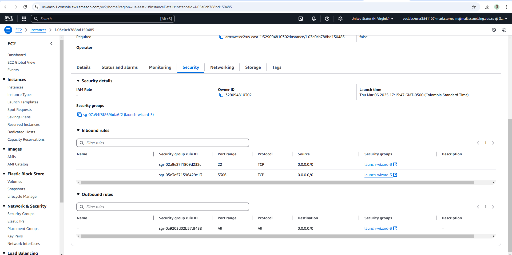

### 3. Test Database Connection

Test the connection using **DBeaver** or directly from the application running on your local machine.

#### Screenshots:
- Local Database Connection: 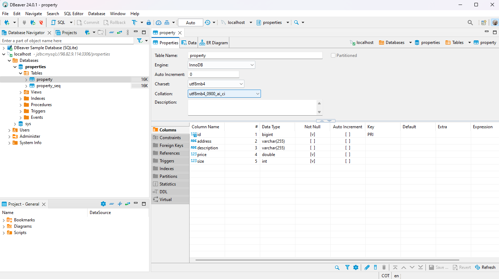
- Application Database Connection (Local): 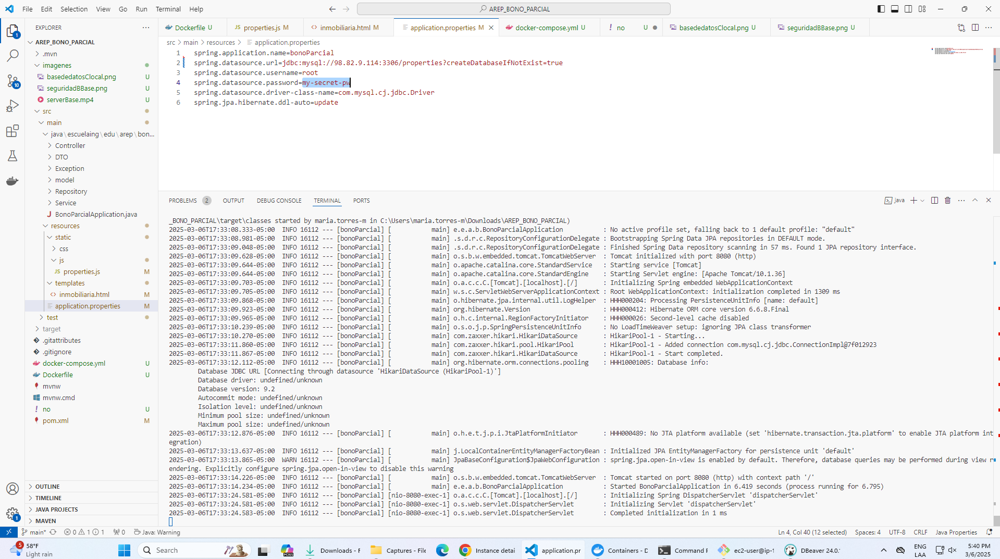

### 4. Configure the Spring Boot Application

Update your `application.properties` file with the correct database connection details:

```properties
spring.application.name=bonoParcial
spring.datasource.url=${SPRING_DATASOURCE_URL}
spring.datasource.username=${SPRING_DATASOURCE_USERNAME}
spring.datasource.password=${SPRING_DATASOURCE_PASSWORD}
spring.datasource.driver-class-name=com.mysql.cj.jdbc.Driver
spring.jpa.properties.hibernate.dialect=org.hibernate.dialect.MySQL8Dialect
spring.jpa.hibernate.ddl-auto=update
spring.jpa.show-sql=true
```

**Dockerfile Configuration**:
Update the `Dockerfile` to ensure the application is properly packaged and deployed.

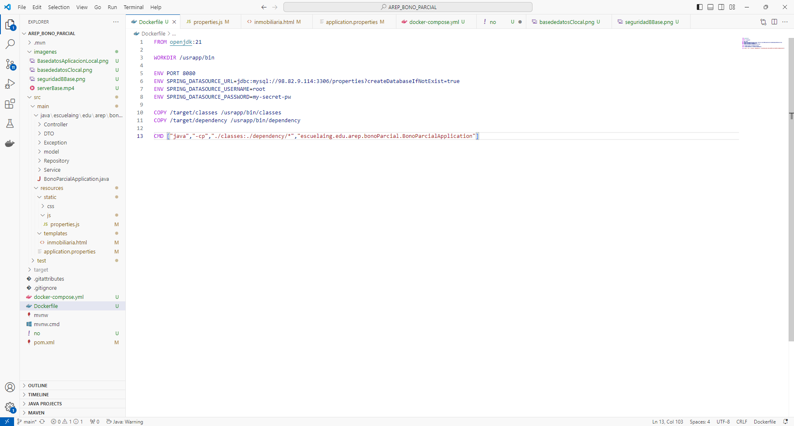

### 5. Create the Docker Image

To include all dependencies, add the following Maven plugin to your `pom.xml`:

```xml
<plugin>
    <groupId>org.apache.maven.plugins</groupId>
    <artifactId>maven-dependency-plugin</artifactId>
    <version>3.0.1</version>
    <executions>
        <execution>
            <id>copy-dependencies</id>
            <phase>package</phase>
            <goals>
                <goal>copy-dependencies</goal>
            </goals>
        </execution>
    </executions>
</plugin>
```

#### Build the Docker Image:

```bash
docker build --tag appproperties .
```

After the image is built, you can view it using the `docker ps` command or from Docker Desktop.

#### Example Output:

```bash
CONTAINER ID   IMAGE          COMMAND                  CREATED       STATUS             PORTS                               NAMES
7d42f76bc82b   mysql:latest   "docker-entrypoint.s…"   9 hours ago   Up About an hour   0.0.0.0:3306->3306/tcp, 33060/tcp   properties
```

### 6. Create the Docker Container

To create the container, run:

```bash
docker run -d -p 34000:6000 --name apppropertiescontainer appproperties
```

#### Example Output:
```bash
2a3c3e13ea1741af9793d5d3316407a8f46f8449752737df7dd33faac7a8e239
```

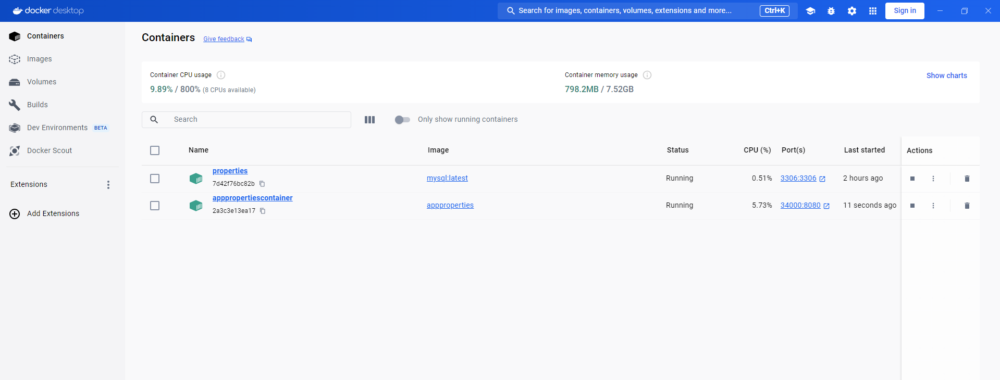

### 7. Tag the Image for Docker Hub

Tag your image to point to your Docker Hub repository:

```bash
docker tag appproperties mandarina972310/crudproperties
```

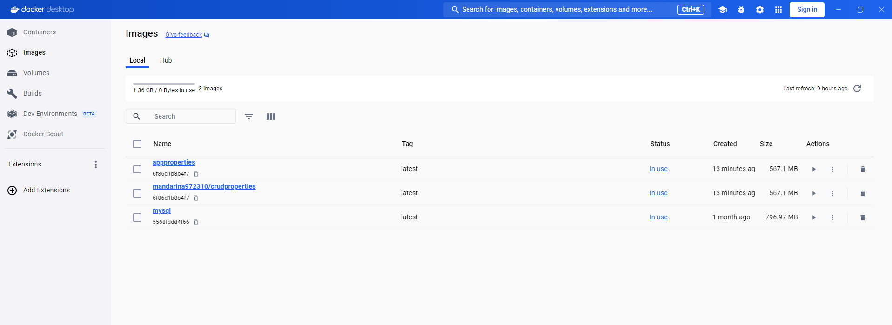

### 8. Push the Image to Docker Hub

Log in to Docker Hub and push the image using the following commands:

```bash
docker login
docker push mandarina972310/crudproperties:latest
```

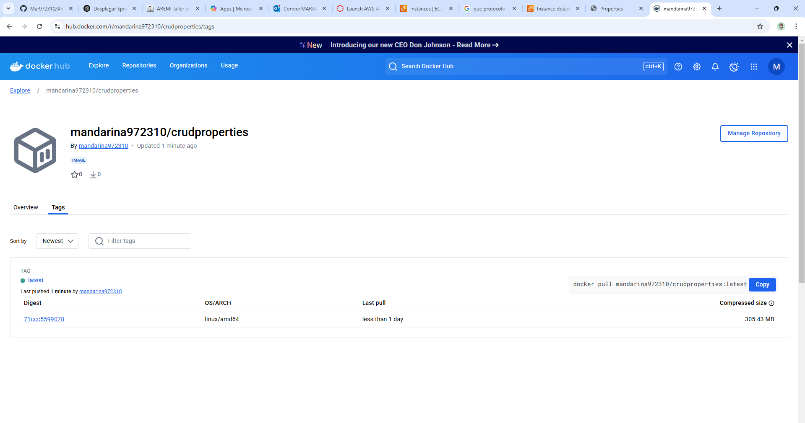

## 9. Install Docker on AWS

From the EC2 instance in AWS, install Docker with the following command:

```bash
sudo yum install docker
```

### Command Output:

```
Installed:
  containerd-1.7.25-1.amzn2023.0.1.x86_64
  docker-25.0.8-1.amzn2023.0.1.x86_64
  iptables-libs-1.8.8-3.amzn2023.0.2.x86_64
  iptables-nft-1.8.8-3.amzn2023.0.2.x86_64
  libcgroup-3.0-1.amzn2023.0.1.x86_64
  libnetfilter_conntrack-1.0.8-2.amzn2023.0.2.x86_64
  libnfnetlink-1.0.1-19.amzn2023.0.2.x86_64
  libnftnl-1.2.2-2.amzn2023.0.2.x86_64
  pigz-2.5-1.amzn2023.0.3.x86_64
  runc-1.2.4-1.amzn2023.0.1.x86_64

Complete!
```

## 10. Start the Docker Service

Start the Docker service with the following command:

```bash
sudo service docker start
```

### Command Output:

```
Redirecting to /bin/systemctl start docker.service
```

## 11. Create a User with Permissions (Optional)

If you don’t want to use `sudo` before every Docker command, you can create a user with permissions:

```bash
sudo usermod -a -G docker ec2-user
```

After running this command, you must log out of the SSH session and log back in.

### 12. Pull the Image from Docker Hub

Download the image from Docker Hub on your AWS instance:

```bash
docker pull mandarina972310/crudproperties:latest
```

Then, run the application container on AWS:

```bash
docker run -d -p 8080:8080 --name appproperties mandarina972310/crudproperties:latest
```

#### Example Output:

```bash
1977c28fee77576247c902bcf8639eaa0649f40d6ae4e9e7717cebb091f49857
```

### 13. Enable the Port on AWS

You need to allow the port used in the Docker container (8080) in the AWS security settings. Add a new inbound rule to the security group.

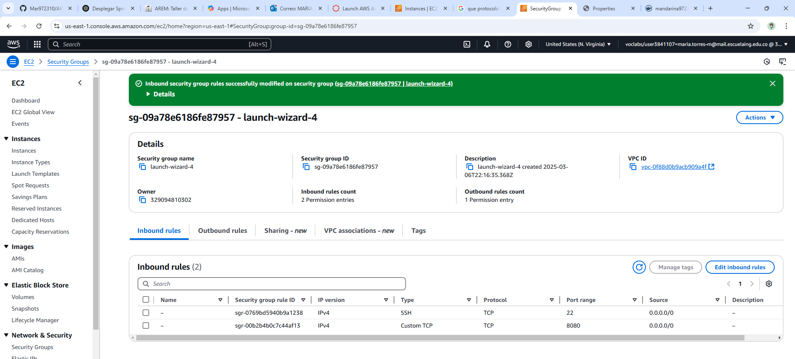

Once completed, you can access the application at:

```
http://ec2-44-210-144-162.compute-1.amazonaws.com:8080/home
```

### 14. Deployment Video

A video of the complete deployment process is available here:


# TEST REPORT - Property Management System

## Autor

Name: Maria Valentina Torres Monsalve

## Date

Date: 06/03/2025

## Test conducted

### PropertyControllerTest

1. **`createProperty_ShouldReturnCreatedProperty`**  
   Verifies that the controller returns a **201 (Created)** status code and the created object when the property is successfully created.

2. **`createProperty_ShouldReturnBadRequest_WhenExceptionOccurs`**  
   Checks that if an exception occurs during creation, a **400 (Bad Request)** status code is returned with the corresponding error message.

3. **`allProperty_ShouldReturnListOfProperties`**  
   Validates that the controller returns a **200 (OK)** status code and a list of properties when fetching all properties.

4. **`getProperty_ShouldReturnProperty_WhenExists`**  
   Confirms that a specific property is retrieved with a **200 (OK)** status code when it exists.

5. **`getProperty_ShouldReturnBadRequest_WhenPropertyNotFound`**  
   Ensures that if the property is not found, a **400 (Bad Request)** status code is returned with an error message.

6. **`updateProperty_ShouldReturnUpdatedProperty`**  
   Verifies that when updating an existing property, a **200 (OK)** status code is returned along with the updated object.

7. **`updateProperty_ShouldReturnNotFound_WhenPropertyDoesNotExist`**  
   Validates that if an attempt is made to update a non-existent property, a **400 (Bad Request)** status code is returned with the error message.

8. **`deleteProperty_ShouldReturnSuccessMessage`**  
   Confirms that when deleting an existing property, a **200 (OK)** status code is returned with the message **"Eliminado con éxito"** ("Successfully deleted").

9. **`deleteProperty_ShouldReturnNotFound_WhenPropertyDoesNotExist`**  
   Ensures that if the property to be deleted does not exist, a **404 (Not Found)** status code is returned with the corresponding error message.

### PropertyServiceTest

1. **`createProperty_ShouldReturnPropertyDTO_WhenSuccessful`**  
   Verifies that when a property is successfully created, the `PropertyDTO` is returned and the repository's `save` method is called once.

2. **`createProperty_ShouldThrowException_WhenRepositoryFails`**  
   Checks that if an exception occurs during property creation (e.g., repository fails), a `PropertyException` is thrown with the expected message.

3. **`getAllProperties_ShouldReturnList_WhenPropertiesExist`**  
   Ensures that when there are properties in the repository, a list of `PropertyDTO` is returned, and the repository's `findAll` method is called once.

4. **`getProperty_ShouldReturnPropertyDTO_WhenFound`**  
   Verifies that when a property is found by its ID, the `PropertyDTO` is returned and the repository's `findById` method is called once.

5. **`getProperty_ShouldThrowException_WhenIdIsNull`**  
   Ensures that when the ID passed to `getProperty` is `null`, a `PropertyException` is thrown with the expected message.

6. **`updateProperty_ShouldReturnUpdatedPropertyDTO_WhenSuccessful`**  
   Validates that when a property is successfully updated, the updated `PropertyDTO` is returned, and the repository's `save` method is called once.

7. **`updateProperty_ShouldThrowException_WhenPropertyNotFound`**  
   Checks that when an attempt is made to update a non-existent property, a `PropertyException` is thrown with the appropriate error message.

8. **`updateProperty_ShouldThrowException_WhenRepositoryFails`**  
   Verifies that if the repository fails while saving the updated property, a `PropertyException` is thrown with the expected message.

9. **`deleteProperty_ShouldCallRepositoryDeleteById_WhenSuccessful`**  
   Confirms that when deleting a property, the repository's `deleteById` method is called once without any exception.

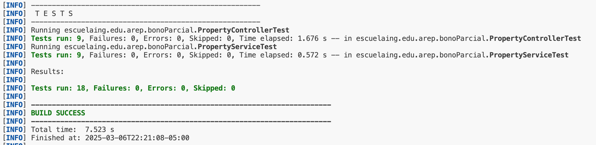
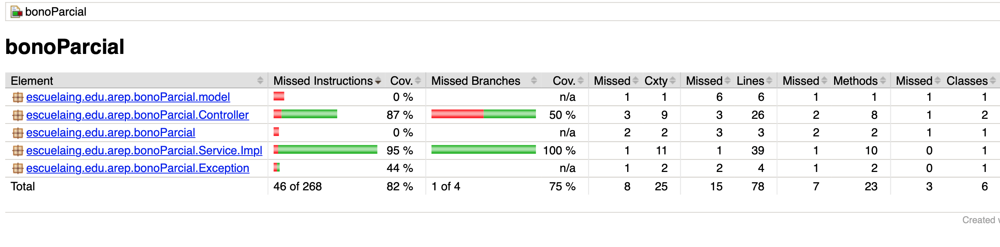